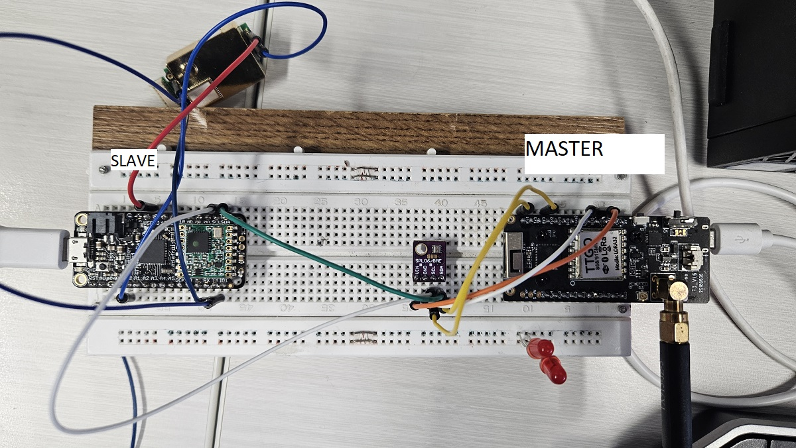

# I2C

2 wire communication between devices. 3 actual pins needed, SCL (clock), SDA (data) and GND (Ground).

# Devices

The setup we are using is a LoRa master and an I2C slave talking to the weather station and other I2C sensors.

